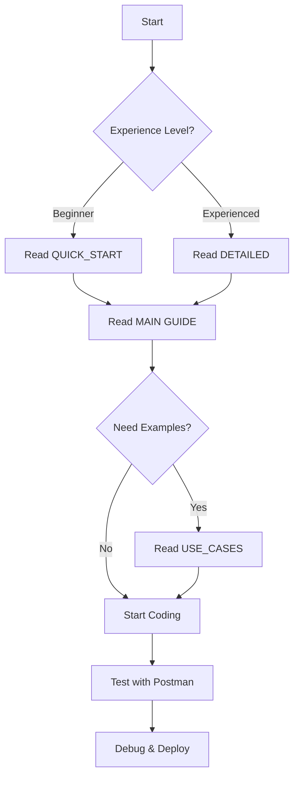

# 📚 Tài Liệu Flutter: Bài Thuốc & Món Ăn - Danh Mục

> Bộ tài liệu hoàn chỉnh dành cho Flutter developers để tích hợp các tính năng **Bài Thuốc** (Medical Articles) và **Phân Tích Thành Phần Dinh Dưỡng Món Ăn** (Food Analysis).

---

## 📑 Danh Sách Tài Liệu

### 1. 📱 **Hướng Dẫn Chính** - `FLUTTER_BAI_THUOC_MON_AN_GUIDE.md`
   - **Đối tượng**: Developers mới bắt đầu
   - **Thời gian đọc**: 30-45 phút
   - **Nội dung**:
     - Tổng quan chức năng
     - Hướng dẫn cơ bản về API
     - Các endpoints chi tiết (Bài Thuốc & Phân Tích Món Ăn)
     - Mô hình dữ liệu (TypeScript interfaces)
     - Ví dụ code Flutter (Models, Services, Providers, Screens)
     - Xử lý lỗi
     - Best practices

   **Khi nào dùng**: Đây là tài liệu chính để hiểu toàn bộ features

---

### 2. ⚡ **Quick Start** - `FLUTTER_QUICK_START.md`
   - **Đối tượng**: Developers muốn bắt đầu nhanh
   - **Thời gian đọc**: 10-15 phút
   - **Nội dung**:
     - 5 bước cơ bản để bắt đầu
     - Dependencies cần thiết
     - Simple code samples
     - Tips & tricks
     - Troubleshooting nhanh
     - Full example app

   **Khi nào dùng**: Khi bạn chỉ muốn bắt đầu nhanh mà không đi vào chi tiết

---

### 3. 🔧 **Hướng Dẫn Chi Tiết** - `FLUTTER_INTEGRATION_DETAILED.md`
   - **Đối tượng**: Developers muốn hiểu sâu về architecture
   - **Thời gian đọc**: 60-90 phút
   - **Nội dung**:
     - Yêu cầu tiên quyết
     - Cấu trúc thư mục khuyến nghị
     - Step-by-step integration (5 bước):
       1. Cấu hình constants
       2. Tạo models
       3. API service
       4. Storage service
       5. Setup main app & providers
     - Unit testing examples
     - Deployment checklist

   **Khi nào dùng**: Khi bạn cần hiểu toàn bộ kiến trúc ứng dụng

---

### 4. 📋 **Use Cases & Workflows** - `FLUTTER_USE_CASES.md`
   - **Đối tượng**: Developers cần hiểu flow thực tế
   - **Thời gian đọc**: 40-60 phút
   - **Nội dung**:
     - 5 use cases chính:
       1. Xem danh sách Bài Thuốc
       2. Xem chi tiết & tăng lượt xem
       3. Tạo Bài Thuốc mới
       4. Phân tích ảnh Món Ăn (chi tiết nhất)
       5. Offline mode & caching
     - Flow diagram cho mỗi use case
     - Code implementation đầy đủ
     - Data flow diagram

   **Khi nào dùng**: Khi bạn cần hiểu cách các features hoạt động trong thực tế

---

## 🗂️ Sơ Đồ Cấu Trúc

```
📦 Flutter Project
├── 📱 FLUTTER_BAI_THUOC_MON_AN_GUIDE.md
│   ├── Tổng quan
│   ├── API Endpoints
│   ├── Models
│   └── Ví dụ code đầy đủ
│
├── ⚡ FLUTTER_QUICK_START.md
│   ├── 5 bước cơ bản
│   ├── Simple examples
│   └── Troubleshooting
│
├── 🔧 FLUTTER_INTEGRATION_DETAILED.md
│   ├── Architecture
│   ├── Step-by-step setup
│   └── Testing & deployment
│
├── 📋 FLUTTER_USE_CASES.md
│   ├── Xem danh sách
│   ├── Xem chi tiết
│   ├── Tạo mới
│   ├── Phân tích ảnh
│   └── Caching
│
└── 📚 README_FLUTTER_DOCS.md (File này)
    └── Navigation giữa các docs
```

---

## 🎯 Hướng Dẫn Chọn Tài Liệu

### Tôi là...

#### 👶 **Newbie / Fresh Start**
```
1. Bắt đầu với: FLUTTER_QUICK_START.md (10 phút)
   ↓
2. Sau đó đọc: FLUTTER_BAI_THUOC_MON_AN_GUIDE.md (30 phút)
   ↓
3. Nếu cần chi tiết: FLUTTER_INTEGRATION_DETAILED.md
```

#### 🚀 **Experienced Developer**
```
1. Skip intro, đọc: FLUTTER_INTEGRATION_DETAILED.md (Architecture)
   ↓
2. Xem code examples: FLUTTER_USE_CASES.md
   ↓
3. Copy-paste và implement
```

#### 🤔 **Đang Debug / Có Vấn Đề**
```
1. Xem: Troubleshooting section trong FLUTTER_QUICK_START.md
   ↓
2. Xem flow details: FLUTTER_USE_CASES.md (Use case tương ứng)
   ↓
3. So sánh: Ví dụ code trong FLUTTER_BAI_THUOC_MON_AN_GUIDE.md
```

#### 📊 **Cần Hiểu Use Cases**
```
1. Chính chủ đọc: FLUTTER_USE_CASES.md
   ↓
2. Xem chi tiết API: FLUTTER_BAI_THUOC_MON_AN_GUIDE.md
```

---

## 📚 API Reference Nhanh

### Bài Thuốc Endpoints

| Endpoint | Method | Auth | Tài Liệu |
|----------|--------|------|----------|
| `/api/BaiThuocAPI` | GET | ❌ | Guide ch. 3 |
| `/api/BaiThuocAPI/{id}` | GET | ❌ | Guide ch. 3 |
| `/api/BaiThuocAPI/create` | POST | ✅ | Guide ch. 3, Use Case 3 |

### Phân Tích Món Ăn Endpoints

| Endpoint | Method | Auth | Tài Liệu |
|----------|--------|------|----------|
| `/api/FoodAnalysis/analyze` | POST | ❌ | Guide ch. 4, Use Case 4 |

---

## 🛠️ Công Cụ & Resources

### Dependencies Cần Thiết
```yaml
http: ^1.1.0                    # HTTP client
image_picker: ^1.0.0            # Image selection
flutter_riverpod: ^2.4.0        # State management (optional)
shared_preferences: ^2.2.0      # Local storage
flutter_secure_storage: ^9.0.0  # Secure token storage
```

### Tools Khuyến Nghị
- **API Testing**: Postman, Thunder Client, REST Client (VS Code)
- **JSON Viewer**: JSON Formatter
- **Git**: GitHub Desktop hoặc Git CLI
- **IDE**: VS Code (+ Flutter extension) hoặc Android Studio

---

## 💡 Key Concepts

### 🔐 Authentication
- Lưu token sau khi login
- Sử dụng token trong header: `Authorization: Bearer <token>`
- Tham khảo: FLUTTER_QUICK_START.md - Tips & Tricks

### 📸 Image Handling
- Hỗ trợ JPG, PNG
- Max size: 5MB
- Nén ảnh trước khi upload (optional)
- Tham khảo: FLUTTER_INTEGRATION_DETAILED.md

### 🔄 Pagination
- Default page size: 10
- Max page size: 50
- Use `page` query param (starts from 1)
- Tham khảo: FLUTTER_USE_CASES.md - Use Case 1

### 💾 Caching & Offline
- Lưu danh sách Bài Thuốc locally
- Return cached data nếu network error
- Tham khảo: FLUTTER_USE_CASES.md - Use Case 5

### ⚠️ Error Handling
- Catch network exceptions
- Show user-friendly messages (Tiếng Việt)
- Log errors cho debugging
- Tham khảo: FLUTTER_BAI_THUOC_MON_AN_GUIDE.md ch. 7

---

## 🚀 Getting Started Path



---

## 📞 FAQ

### Q: Tôi không hiểu API Response format là gì?
**A**: Xem **FLUTTER_BAI_THUOC_MON_AN_GUIDE.md** section "Mô Hình Dữ Liệu"

### Q: Làm sao để handle token trong Flutter?
**A**: Xem **FLUTTER_QUICK_START.md** - Tips & Tricks - Handle Bearer Token

### Q: Phân tích ảnh bị timeout, phải làm sao?
**A**: Xem **FLUTTER_QUICK_START.md** - Troubleshooting

### Q: Cách implement pagination cho Bài Thuốc?
**A**: Xem **FLUTTER_USE_CASES.md** - Use Case 1 (Xem Danh Sách)

### Q: Làm sao để lưu token an toàn?
**A**: Xem **FLUTTER_INTEGRATION_DETAILED.md** - Best Practices

### Q: Có ví dụ full app không?
**A**: Có, trong **FLUTTER_QUICK_START.md** - Full Example App

---

## 📋 Checklist Trước Khi Deploy

- [ ] Đọc xong tài liệu phù hợp
- [ ] Copy các models từ tài liệu
- [ ] Implement API service
- [ ] Test tất cả endpoints với Postman
- [ ] Implement UI screens
- [ ] Add error handling
- [ ] Test trên device thực
- [ ] Optimize images
- [ ] Remove debug logs
- [ ] Update API base URL cho production
- [ ] Secure token storage
- [ ] Test network errors
- [ ] Build APK/IPA
- [ ] Deploy!

---

## 🔗 Cross-References

### Nếu bạn đang xem...

**FLUTTER_QUICK_START.md**
- Muốn chi tiết hơn? → FLUTTER_BAI_THUOC_MON_AN_GUIDE.md
- Muốn architect deep dive? → FLUTTER_INTEGRATION_DETAILED.md
- Muốn xem examples? → FLUTTER_USE_CASES.md

**FLUTTER_BAI_THUOC_MON_AN_GUIDE.md**
- Muốn nhanh hơn? → FLUTTER_QUICK_START.md
- Muốn code patterns? → FLUTTER_USE_CASES.md
- Muốn setup details? → FLUTTER_INTEGRATION_DETAILED.md

**FLUTTER_INTEGRATION_DETAILED.md**
- Muốn examples? → FLUTTER_USE_CASES.md
- Muốn reference API? → FLUTTER_BAI_THUOC_MON_AN_GUIDE.md
- Muốn quick start? → FLUTTER_QUICK_START.md

**FLUTTER_USE_CASES.md**
- Muốn model definitions? → FLUTTER_INTEGRATION_DETAILED.md
- Muốn API endpoints? → FLUTTER_BAI_THUOC_MON_AN_GUIDE.md
- Muốn setup basics? → FLUTTER_QUICK_START.md

---

## 📊 Tài Liệu Statistics

| Tài Liệu | Thời gian Đọc | Dòng Code | Phức Tạp |
|----------|---|---|---|
| FLUTTER_QUICK_START.md | 10-15 min | ~300 | ⭐ |
| FLUTTER_BAI_THUOC_MON_AN_GUIDE.md | 30-45 min | ~1000 | ⭐⭐ |
| FLUTTER_INTEGRATION_DETAILED.md | 60-90 min | ~1500 | ⭐⭐⭐ |
| FLUTTER_USE_CASES.md | 40-60 min | ~2000 | ⭐⭐⭐ |

---

## 🎓 Learning Path Recommended

```
Week 1:
- Monday: Read QUICK_START (1 hour)
- Tuesday-Wednesday: Read MAIN GUIDE (2 hours)
- Thursday: Setup project, copy models (1 hour)
- Friday: Implement basic screens (2 hours)

Week 2:
- Monday: Read INTEGRATION_DETAILED (2 hours)
- Tuesday: Implement API service (2 hours)
- Wednesday: Read USE_CASES (1.5 hours)
- Thursday: Implement features (2 hours)
- Friday: Testing & debugging (2 hours)

Week 3:
- Optimization, caching, error handling
- Deploy to test device
- Ready for production!
```

---

## 📝 Version History

| Version | Date | Changes |
|---------|------|---------|
| 1.0 | 16/01/2025 | Initial release |
| | | - FLUTTER_QUICK_START.md |
| | | - FLUTTER_BAI_THUOC_MON_AN_GUIDE.md |
| | | - FLUTTER_INTEGRATION_DETAILED.md |
| | | - FLUTTER_USE_CASES.md |

---

## 📞 Support

Nếu có câu hỏi:
1. Kiểm tra FAQ section
2. Tìm từ khóa trong tài liệu
3. Xem cross-references
4. Liên hệ team development

---

## 🙏 Thank You

Cảm ơn bạn đã sử dụng tài liệu này. Happy coding! 🚀

---

**Last Updated**: 16/01/2025  
**Created By**: Development Team  
**Version**: 1.0
